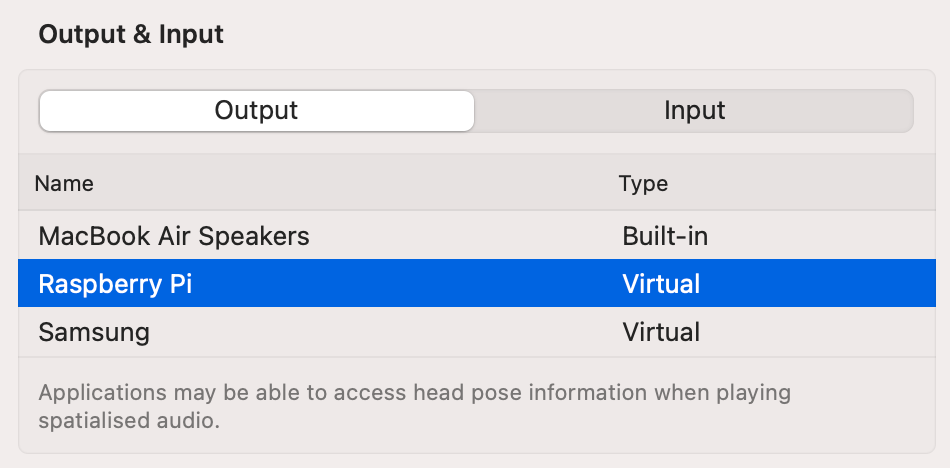

# Roc Virtual Audio Device for macOS

[](https://github.com/roc-streaming/roc-vad/actions) [](https://github.com/roc-streaming/roc-vad/releases) [](https://app.element.io/#/room/#roc-streaming:matrix.org)

<!-- toc -->

- [Summary](#summary)
  * [What is this?](#what-is-this)
  * [How it works?](#how-it-works)
  * [Features](#features)
  * [Design](#design)
- [Donations](#donations)
- [Releases](#releases)
- [Installation](#installation)
  * [Supported platforms](#supported-platforms)
  * [Install from binaries](#install-from-binaries)
  * [Install from sources](#install-from-sources)
- [How to use](#how-to-use)
  * [Health check](#health-check)
  * [Creating sender](#creating-sender)
  * [Creating receiver](#creating-receiver)
  * [Inspecting devices](#inspecting-devices)
  * [Naming devices](#naming-devices)
  * [Device persistence](#device-persistence)
- [Command-line reference](#command-line-reference)
  * [List of commands](#list-of-commands)
  * [Sender options](#sender-options)
  * [Receiver options](#receiver-options)
- [Advanced configuration](#advanced-configuration)
  * [Multiple devices](#multiple-devices)
  * [Multiple endpoints](#multiple-endpoints)
  * [Custom device encoding](#custom-device-encoding)
  * [Custom packet encoding](#custom-packet-encoding)
  * [Custom FEC encoding](#custom-fec-encoding)
  * [Tuning latency](#tuning-latency)
- [Programmatic control](#programmatic-control)
  * [gRPC interface](#grpc-interface)
  * [Socket address](#socket-address)
  * [Vendoring driver](#vendoring-driver)
- [Troubleshooting](#troubleshooting)
  * [Retrieving info](#retrieving-info)
  * [Common issues](#common-issues)
- [Hacking](#hacking)
- [Authors](#authors)
- [License](#license)

<!-- tocstop -->

## Summary

### What is this?

This repo provides macOS **Virtual Audio Device** (VAD) for real-time **audio streaming** to or from remote devices. It is part of [Roc Toolkit](https://github.com/roc-streaming/roc-toolkit) project and is interoperable with both Roc and third-party software.

After installing Roc VAD, you can:

* create and control one or several virtual audio devices, using a command-line tool;
* connect a virtual device to remote sender or receiver;
* configure you local apps to use a virtual device instead of real microphone or speakers.

### How it works?

When you configure your OS or individual app (e.g. VLC) to use Roc VAD output device as a speaker, all sound played to the device is streamed to a remote receiver. Remote receiver could be [PipeWire module](https://docs.pipewire.org/page_module_roc_source.html) or [PulseAudio module](https://github.com/roc-streaming/roc-pulse) running on Linux, [Roc Droid](https://github.com/roc-streaming/roc-droid) running on Android, as well as any C/Go/Java application using Roc Toolkit.

Similarly, when you configure your OS or an app (e.g. Skype) to use Roc VAD input device as a microphone, the sound streamed from remote sender is passed to the local app connected to input device.

Screenshot below shows macOS Sound Preferences with two virtual output devices named "Raspberry Pi" and "Samsung".



### Features

Key features of Roc Toolkit streaming engine, used by Roc VAD:

* real-time streaming with guaranteed latency;
* robust work on unreliable networks like Wi-Fi, due to use of Forward Erasure Correction codes;
* CD-quality audio;
* multiple profiles for different CPU and latency requirements;
* relying on open, standard protocols, like RTP and FECFRAME;
* interoperability with both Roc and third-party software.

Compatible Roc Toolkit senders and receivers include:

* [cross-platform command-line tools](https://roc-streaming.org/toolkit/docs/tools/command_line_tools.html)
* [modules for sound servers](https://roc-streaming.org/toolkit/docs/tools/sound_server_modules.html) (PulseAudio, PipeWire, macOS CoreAudio)
* [C library](https://roc-streaming.org/toolkit/docs/api.html) and [bindings for other languages](https://roc-streaming.org/toolkit/docs/api/bindings.html)
* [applications](https://roc-streaming.org/toolkit/docs/tools/applications.html) (Android)

### Design

Internally, Roc VAD consists of two components:

* `roc_vad.driver`

    A plugin for CoreAudio Audio Server based on [libASPL](https://github.com/gavv/libASPL) library. Driver communicates with HAL, implements streaming, and provides gRPC interface that allows to add, remove, and configure virtual devices on fly.

* `roc-vad`

    A command-line tool that allows to control Roc VAD driver from terminal via its gRPC interface.

For more details, see [HACKING.md](HACKING.md).

## Donations

If you would like to support the project financially, see details on [this page](https://roc-streaming.org/toolkit/docs/about_project/sponsors.html). This project is developed by volunteers in their free time, and your donations will help to spend more time on the project and keep it growing. Thank you!

Special thanks to [Sean McNamara](https://github.com/allquixotic), whose funding helped to complete and release the first version of Roc VAD!

<a href="https://liberapay.com/roc-streaming"></a>

## Releases

The project follows [semantic versioning](https://semver.org/).

The backwards compatibility promise applies only to gRPC interface (see below), but not to command-line tools.

Changelog file can be found here: [CHANGES.md](CHANGES.md).

## Installation

### Supported platforms

macOS 10.15 (Catalina) or later is required.

Both x86_64 (Intel) and arm64 (M1 and further) architectures are supported.

### Install from binaries

Install driver and command-line tool:

```
sudo /bin/bash -c \
  "$(curl -fsSL https://raw.githubusercontent.com/roc-streaming/roc-vad/HEAD/install.sh)"
```

⚠️ After installation, reboot your Mac.

To **uninstall** everything, run:

```
sudo roc-vad uninstall
```

Then reboot your Mac.

### Install from sources

Prerequisites:

* Install XCode Command Line Tools
* Install [Homebrew](https://brew.sh/)

Install build dependencies:

```
brew install cmake scons autoconf automake pkg-config libtool go
```

Clone repo:

```
git clone https://github.com/roc-streaming/roc-vad.git
```

Go to the project directory:

```
cd roc-vad
```

Build:

```
make
```

Install:

```
sudo make install
```

Now, either reboot your Mac, **OR** run:

```
sudo make kickstart
```

This command will restart macOS sound server. Usually it's enough, but some apps may not handle sound server restart well, so reboot is preferred.

To **uninstall** everything, run:

```
sudo make uninstall
```

## How to use

### Health check

First, check that sound server driver was successfully loaded:

```
$ roc-vad info
driver is loaded

driver:
  version: 0.0.1
  commit:  76ca125

client:
  version: 0.0.1
  commit:  76ca125
```

> If it didn't work, refer to [Troubleshooting](#troubleshooting) section below.

### Creating sender

If you want to **stream from macOS** to remote receiver, create **virtual speakers**:

```
$ roc-vad device add sender
device #1

  type:   sender
  uid:    aba744-43a201-c27dff-4de630
  name:   Roc Virtual Device #1
  state:  on

  ...
```

Check that the created device is present:

```
$ roc-vad device list
index    type       state   uid                            name
1        sender     on      aba744-43a201-c27dff-4de630    Roc Virtual Device #1
```

After creating sender device, you can connect it to remote receiver. Usually you need to connect three endpoints: source packets (audio traffic), repair packets (for loss recovery), and control packets (for latency tuning).

E.g. if local sender device has index "1" and remote receiver is running at 192.168.0.1 and uses three ports 10001, 10002, and 10003 for source, repair, and control endpoints, then run:

```
$ roc-vad device connect 1 \
   --source rtp+rs8m://192.168.0.1:10001 \
   --repair rs8m://192.168.0.1:10002 \
   --control rtcp://192.168.0.1:10003
endpoint:
  slot:       0
  interface:  audiosrc
  uri:        rtp+rs8m://192.168.0.1:10001
endpoint:
  slot:       0
  interface:  audiorpr
  uri:        rs8m://192.168.0.1:10002
endpoint:
  slot:       0
  interface:  audioctl
  uri:        rtcp://192.168.0.1:10003
```

Now, applications play audio to `Roc Virtual Device #1`, the sound is streamed to the remote receiver. If there are multiple applications, the streams are mixed.

> Note that the sound written to sender device is not heard locally. If you need it, you can use third-party software like [BlackHole](https://github.com/ExistentialAudio/BlackHole) to create a loopback from sender device to local speakers.

### Creating receiver

If you want to **stream to macOS** from a remote sender, create **virtual microphone**:

```
$ roc-vad device add receiver
device #2

  type:   receiver
  uid:    934855-95c5ca-9841c4-645f85
  name:   Roc Virtual Device #2
  state:  on

  ...
```

Check that device is present:

```
$ roc-vad device list
index    type       state   uid                            name
1        sender     on      aba744-43a201-c27dff-4de630    Roc Virtual Device #1
2        receiver   on      934855-95c5ca-9841c4-645f85    Roc Virtual Device #2
```

After creating receiver device, you can bind it to local endpoints. Usually you need to bind three endpoints: source packets (audio traffic), repair packets (for loss recovery), and control packets (for latency tuning).

E.g. if receiver device has index "2" and you want to use three ports 10001, 10002, and 10003 for source, repair, and control endpoints, then run:

```
$ roc-vad device bind 2 \
   --source rtp+rs8m://0.0.0.0:10001 \
   --repair rs8m://0.0.0.0:10002 \
   --control rtcp://0.0.0.0:10003
endpoint:
  slot:       0
  interface:  audiosrc
  uri:        rtp+rs8m://0.0.0.0:10001
endpoint:
  slot:       0
  interface:  audiorpr
  uri:        rs8m://0.0.0.0:10002
endpoint:
  slot:       0
  interface:  audioctl
  uri:        rtcp://0.0.0.0:10003
```

Now, applications that records audio from `Roc Virtual Device #2` gets the sound streamed to receiver from remote senders. If there are multiple senders, the streams are mixed.

> Note that the sound sent to receiver device is not heard locally. Receiver device acts as a virtual microphone for other applications, not as a player for received sound. If you need it, you can use third-party software like [BlackHole](https://github.com/ExistentialAudio/BlackHole) to create a loopback from receiver device to local speakers. Or don't use virtual device at all and instead run [roc-recv](https://roc-streaming.org/toolkit/docs/tools/command_line_tools.html) command-line tool.

### Inspecting devices

To get a list of all roc-vad devices:

```
$ roc-vad device list
index    type       state   uid                            name
1        sender     on      aba744-43a201-c27dff-4de630    Roc Virtual Device #1
2        receiver   on      934855-95c5ca-9841c4-645f85    Roc Virtual Device #2
```

For more detailed information:

```
$ roc-vad device list --detail
device #1

  type:   sender
  uid:    aba744-43a201-c27dff-4de630
  name:   Roc Virtual Device #1
  state:  on

  ...

device #2

  type:   receiver
  uid:    934855-95c5ca-9841c4-645f85
  name:   Roc Virtual Device #2
  state:  on

  ...
```

For information about single device:

```
$ roc-vad device show 1
device #1

  type:   sender
  uid:    aba744-43a201-c27dff-4de630
  name:   Roc Virtual Device #1
  state:  on

  ...
```

### Naming devices

Each roc-vad device has:

* `index` - small numeric identifier; after device is removed, its index may be reused soon
* `uid` - long string identifier; each newly created device has a unique uid
* `name` - human-readable device name presented in Sound Preferences

By default, these fields are generated automatically, however you can specify `uid` or `name` explicitly, e.g.:

```
$ roc-vad device add sender --uid "my_unique_id" --name "My Device Name"
device #3

  type:   sender
  uid:    my_unique_id
  name:   My Device Name
  state:  on

  ...
```

All commands that accept device index as an argument also provide `--uid` flag, which allows to specify uid instead of index, e.g.:

```
$ roc-vad device show --uid aba744-43a201-c27dff-4de630
device #1

  type:   sender
  uid:    aba744-43a201-c27dff-4de630
  name:   Roc Virtual Device #1
  state:  on

  ...
```

### Device persistence

All created devices and all their settings (including bound and connected endpoints) are stored persistently. If you restart audio server or reboot, roc-vad will recreate them.

If you want to disable device temporarily without losing its configuration, you can use `disable` and `enable` commands:

```
$ roc-vad device disable 1
disabled device with index 1
```

```
$ roc-vad device enable 1
enabled device with index 1
```

If you want to remove device permanently, use `del` command:

```
$ roc-vad device del 1
deleted device with index 1
```

## Command-line reference

### List of commands

| command                       | description                                  |
|-------------------------------|----------------------------------------------|
| `roc-vad info`                | Print driver and tool info                   |
| `roc-vad logcat`              | Receive and print logs from driver           |
| `roc-vad device list`         | List virtual devices                         |
| `roc-vad device show`         | Show info for one device                     |
| `roc-vad device add sender`   | Add sender device (virtual speakers)         |
| `roc-vad device add receiver` | Add receiver device (virtual mic)            |
| `roc-vad device del`          | Delete virtual device                        |
| `roc-vad device enable`       | Activate and show device                     |
| `roc-vad device disable`      | Deactivate and hide device                   |
| `roc-vad device bind`         | Bind virtual device to local endpoint(s)     |
| `roc-vad device connect`      | Connect virtual device to remote endpoint(s) |
| `roc-vad uninstall`           | Uninstall driver and tool from system        |

To get list of supported options of each command, you can run `roc-vad <command> --help`, `roc-vad <command> <sub-command> --help`, and so on.

### Sender options

When you create sender virtual device using `roc-vad device add sender`, the following options are available.

(You can also run `roc-vad device add sender --help` to see them).

| option                   | default                | description                                                                 | note                          |
|--------------------------|------------------------|-----------------------------------------------------------------------------|-------------------------------|
| --device-rate            | 44100                  | virtual device sample rate                                                  |                               |
| --device-chans           | stereo                 | virtual device channel layout (mono, stereo)                                |                               |
| --device-buffer          | 60ms                   | virtual device buffer size (e.g. 123ms)                                     |                               |
| --packet-encoding-id     | 10                     | encoding id for audio packets (any number, but same on sender and receiver) | for custom network encoding   |
| --packet-encoding-rate   | 44100                  | sample rate for audio packets                                               | for custom network encoding   |
| --packet-encoding-format | s16                    | sample format for audio packets (s16)                                       | for custom network encoding   |
| --packet-encoding-chans  | stereo                 | channel layout for audio packets (mono, stereo)                             | for custom network encoding   |
| --packet-length          | 5ms                    | audio packet length (e.g. 123ms)                                            |                               |
| --packet-interleaving    | false                  | enable packet interleaving                                                  |                               |
| --fec-encoding           | rs8m                   | encoding for FEC packets (default, disable, rs8m, ldpc)                     |                               |
| --fec-block-nbsrc        | 18                     | number of source packets in FEC block                                       |                               |
| --fec-block-nbrpr        | 10                     | number of repair packets in FEC block                                       |                               |
| --resampler-backend      | selected automatically | resampler backend (default, builtin, speex, speexdec)                       |                               |
| --resampler-profile      | medium                 | resampler profile (default, high, medium, low)                              |                               |
| --latency-backend        | disabled               | latency tuner backend (default, niq)                                        | for sender-side latency tuner |
| --latency-profile        | disabled               | latency tuner profile (default, intact, responsive, gradual)                | for sender-side latency tuner |
| --target-latency         | disabled               | target latency (e.g. 123ms)                                                 | for sender-side latency tuner |
| --min-latency            | disabled               | minimum latency (e.g. 123ms)                                                | for sender-side latency tuner |
| --max-latency            | disabled               | maximum latency (e.g. 123ms)                                                | for sender-side latency tuner |

### Receiver options

When you create receiver virtual device using `roc-vad device add receiver`, the following options are available.

(You can also run `roc-vad device add receiver --help` to see them).

| option                   | default                | description                                                                 | note                        |
|--------------------------|------------------------|-----------------------------------------------------------------------------|-----------------------------|
| --device-rate            | 44100                  | virtual device sample rate                                                  |                             |
| --device-chans           | stereo                 | virtual device channel layout (mono, stereo)                                |                             |
| --device-buffer          | 60ms                   | virtual device buffer size (e.g. 123ms)                                     |                             |
| --packet-encoding-id     | 10                     | encoding id for audio packets (any number, but same on sender and receiver) | for custom network encoding |
| --packet-encoding-rate   | 44100                  | sample rate for audio packets                                               | for custom network encoding |
| --packet-encoding-format | s16                    | sample format for audio packets (s16)                                       | for custom network encoding |
| --packet-encoding-chans  | stereo                 | channel layout for audio packets (mono, stereo)                             | for custom network encoding |
| --resampler-backend      | selected automatically | resampler backend (default, builtin, speex, speexdec)                       |                             |
| --resampler-profile      | medium                 | resampler profile (default, high, medium, low)                              |                             |
| --latency-backend        | selected automatically | latency tuner backend (default, niq)                                        |                             |
| --latency-profile        | selected automatically | latency tuner profile (default, intact, responsive, gradual)                |                             |
| --target-latency         | 200ms                  | target latency (e.g. 123ms)                                                 |                             |
| --min-latency            | selected automatically | minimum latency (e.g. 123ms)                                                |                             |
| --max-latency            | selected automatically | maximum latency (e.g. 123ms)                                                |                             |
| --no-play-timeout        | selected automatically | no playback timeout (e.g. 123ms)                                            |                             |
| --choppy-play-timeout    | selected automatically | choppy playback timeout (e.g. 123ms)                                        |                             |

## Advanced configuration

### Multiple devices

You can create multiple sender or receiver devices, e.g. if you want to connect different apps with different remote peers.

macOS does not provide UI to select audio device per-app, but there are third-party tools for doing that. Also, many apps have built-in UI to select audio input / output.

### Multiple endpoints

Another possibility is to create multiple *slots* within a single sender or receiver device:

* For sender, you can create multiple slots, and connect each slot to different remote receiver. The sound written to sender device will be sent to every slot.

* For receiver, you can create multiple slots, and bind each slot to different set of endpoints, e.g. using different network interface or protocol. The sound retrieved from all slots is mixed.

To use slots, just provide `--slot` argument to `device bind` or `device connect` command. Each slot is identified by a number; you can use any number, it does not have any semantics. When `--slot` is omitted, slot `0` is used.

Example of connecting a sender to two remote receivers:

```
$ roc-vad device connect 1 --slot 0 \
   --source rtp+rs8m://192.168.0.1:10001 \
   --repair rs8m://192.168.0.1:10002 \
   --control rtcp://192.168.0.1:10003
```

```
$ roc-vad device connect 1 --slot 1 \
   --source rtp+rs8m://10.9.8.14:20001 \
   --repair rs8m://10.9.8.14:20002 \
   --control rtcp://10.9.8.14:20003
```

### Custom device encoding

You can use the following options to control how Roc VAD device present itself to local applications:

* `--device-rate`
* `--device-chans`

By default, Roc VAD uses 44100Hz with 16-bit stereo.

These options may be useful if you want to avoid automatic conversions when you know specific requirements of your applications.

E.g., if application sample rate does not match virtual device sample rate, CoreAudio will automatically perform conversion. Similarly, if virtual device sample rate does not match packet encoding sample rate (see below), Roc Toolkit will automatically perform conversion.

Note that these options affect only local encoding, but not encoding of network packets.

### Custom packet encoding

The following options can be used if you want Roc VAD to use specific encoding for network audio packets:

* `--packet-encoding-id` - arbitrary encoding identifier, any number in range [1; 255]
* `--packet-encoding-rate` - sampling rate (e.g. 44100)
* `--packet-encoding-format` - sample format (e.g. `s16` for 16-bit signed integers)
* `--packet-encoding-chans` - channel layout (e.g. `stereo`)

By default, Roc VAD uses 44100Hz with 16-bit stereo.

If you use custom encoding, all four parameters should be provided on **both sender and receiver** and have **exact same values**. Only encoding identifier is carried in packets and is then used to determine stream parameters.

### Custom FEC encoding

To configure which encoding is used for loss repair, use `--fec-encoding` option.

Available values are:

* `disable` - disable FEC
* `rs8m` - use Reed-Solomon FEC
* `ldpc` - use LDPC-Staircase FEC

By default, Roc VAD uses Reed-Solomon (`rs8m`) FEC encoding.

This parameter should be provided on **both sender and receiver** and have **exact same value**.

### Tuning latency

Both sender and receiver latency is affected by `--device-buffer` option, which defines how much latency device itself introduces.

Receiver-side parameters essential for latency are:

* `--target-latency` - which latency should be maintained
* `--min-latency` - which minimum latency causes session restart
* `--max-latency` - which maximum latency causes session restart

You can also force specific latency tuner settings (by default they're auto-selected based on target latency):

* `--latency-backend`:
  * `niq` - tune latency based on Network Incoming Queue size
* `--latency-profile`:
  * `intact` - disable latency tuner
  * `responsive` - quickly react to changes; good for low latency, but also requires low network jitter
  * `gradual` - smoothly react to changes; can handle high network jitter, but can't handle very low latency

> Note: By default, latency tuning happens on receiver side. It is also possible (though rarely needed) to do it on sender side. For that reason, all parameters above are also available on sender, but are disabled by default. If you enable them on sender, you likely want to disable them on receiver by using `intact` latency profile.

There are also sender-side parameters that affect latency:

* `--packet-length` - audio packet length
* `--fec-block-nbsrc` - number of audio packets in a FEC block (if FEC is enabled)
* `--fec-block-nbrpr` - number of redundancy packets in a FEC block (if FEC is enabled)

For lower latency, you may need lower packet length and FEC block size. And vice versa, for higher latency and network jitter, you may need to increase both packet length (for less overhead) and FEC block size (for better repair).

## Programmatic control

### gRPC interface

You can control Roc VAD driver from any programming language via [gRPC](https://grpc.io/) interface.

You can to do everything you can do via command-line tool, which itself is just a wrapper for the same RPC calls. Unlike the command-line tool, gRPC interface will maintain backward compatibility on updates.

More details are available here:

* [driver_protocol.proto](rpc/driver_protocol.proto) - protocol definition
* [RPC.md](RPC.md) - generated protocol documentation

To use RPC interface, you'll need to copy `driver_protocol.proto` to your project and use gRPC tools to generate client code for the language of your choice ([1](https://grpc.io/docs/languages/), [2](https://github.com/grpc/grpc-swift)).

Roc VAD RPC interface mostly mirrors underlying C API of Roc Toolkit. Please refer to the [C API reference](https://roc-streaming.org/toolkit/docs/api/reference.html) for more details on semantics of various options.

### Socket address

By default, driver starts (unauthenticated) gRPC server at `127.0.0.1:9712`.

If you want to change the address, you can edit `DriverSocket` entry in `/Library/Audio/Plug-Ins/HAL/roc_vad.driver/Contents/Info.plist` plist file. Both driver and command-line tool read address from there.

### Vendoring driver

If you're going to vendor a copy or a fork of Roc VAD driver and ship with your application, please change `DRIVER_BUNDLE_NAME`, `DRIVER_BUNDLE_ID`, `DRIVER_UUID`, and `DRIVER_SOCKET` via CMake.

This is necessary to ensure that your copy can co-exist with the original on the same system.

## Troubleshooting

### Retrieving info

To enable verbose logging of the command line tool, use `-v` flag. Specify it multiple times to increase verbosity:

```
$ roc-vad -vv info
debug: opened driver bundle at "/Library/Audio/Plug-Ins/HAL/roc_vad.driver"
debug: obtained value "127.0.0.1:9712" for key "DriverSocket" from driver bundle
info: trying to connect to driver at 127.0.0.1:9712
debug: creating rpc channel
debug: sending ping command
...
```

To print logs from driver, use `logcat` command. It connects to driver via RPC and streams its logs to stdout:

```
$ roc-vad logcat
03:30:33.511 [DD] received stream_logs command
03:30:33.511 [DD] attaching log sender to dist sink
...
```

Alternatively, you can use `syslog` makefile target. It streams logs that driver sends to system log. Basically they are the same logs as produced by `logcat` command, but in slightly different format, and possibly truncated and deduplicated:

```
$ make syslog
log stream --predicate 'sender == "roc_vad"'
Filtering the log data using "process == "coreaudiod" OR sender == "roc_vad""
Timestamp                       Thread     Type        Activity             PID    TTL
2023-04-13 03:31:54.896185+0400 0xe38a     Default     0x0                  11980  0
  com.apple.audio.Core-Audio-Driver-Service: (roc_vad) [DD] received ping command
2023-04-13 03:31:54.897686+0400 0xe38a     Default     0x0                  11980  0
  com.apple.audio.Core-Audio-Driver-Service: (roc_vad) [DD] received get_info command
...
```

To check if virtual device is actually added to the system, use `sysprof` target. It runs `system_profiler SPAudioDataType`, which should print something like this:

```
$ make sysprof
Audio:

    Devices:

        Roc Virtual Device #1:

          Manufacturer: Roc Streaming
          Output Channels: 2
          Current SampleRate: 44100
          Transport: Virtual
          Output Source: Default
```

### Common issues

* **Can't connect to driver**

    Make sure you did not forget to reboot computer (preferably) or restart `coreaudiod` after installing Roc VAD.

* **Device not appearing**

    Try to disable device and enable it again using `device disable` and `device enable` commands.

* **Network connectivity**

    Ensure that sent packets reach receiver.

    When you start streaming from sender to receiver, you should see information about connected sender in receiver's logs. If you don't, it indicates problems with network connection, e.g. you use incorrect address or port, or a firewall is blocking traffic.

* **You hear awful noises**

    Make sure that `--packet-encoding` and `--fec-encoding` match on sender and receiver.

* **Playback stuttering**

    If you hear stuttering, try increasing device buffer length of virtual device and/or target latency of the receiver. They are controlled by `--device-buffer` and `--target-latency` options.

## Hacking

Contributions in any form are always welcome! You can find issues needing help using [help wanted](https://github.com/roc-streaming/roc-vad/labels/help%20wanted) and [good first issue](https://github.com/roc-streaming/roc-vad/labels/good%20first%20issue) labels.

If you would like to dig into the project internals, have a look at [HACKING.md](HACKING.md).

## Authors

See [here](https://github.com/roc-streaming/roc-vad/graphs/contributors).

## License

Contents of the repository is licensed under [MPL-2.0](LICENSE).

For details on Roc Toolkit licensing, see [here](https://roc-streaming.org/toolkit/docs/about_project/licensing.html).
